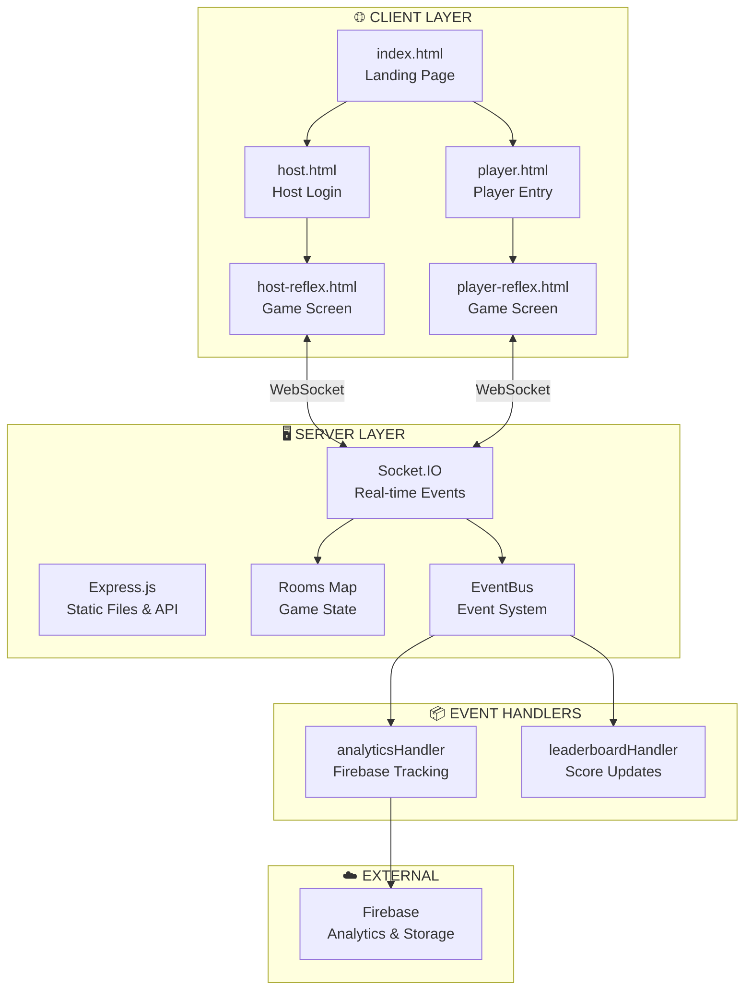
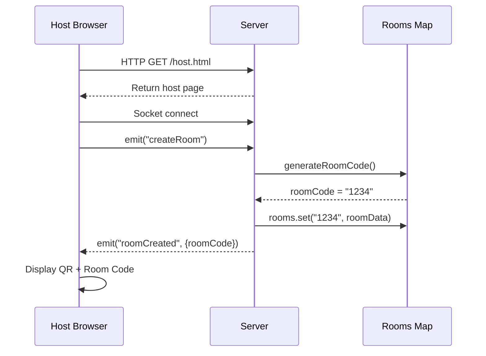
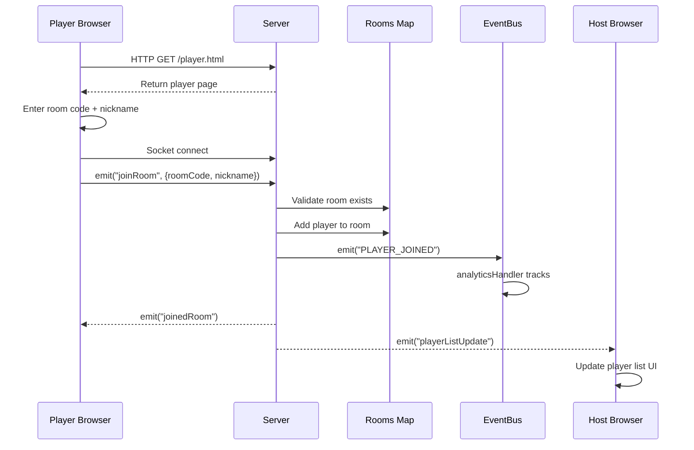
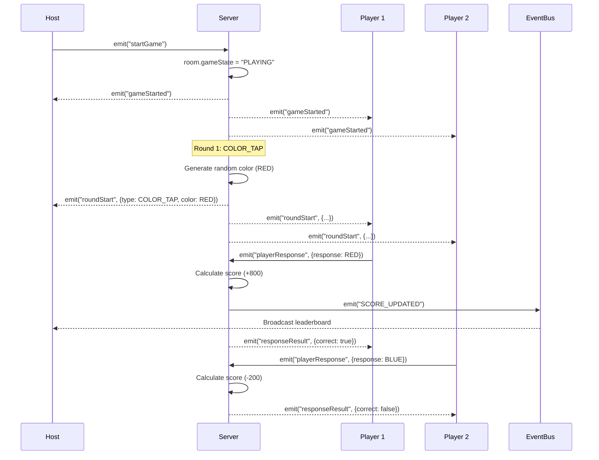
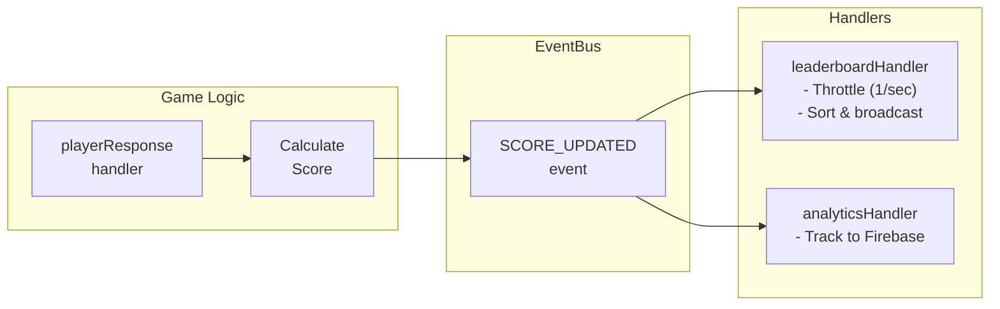
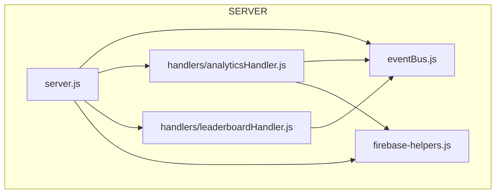
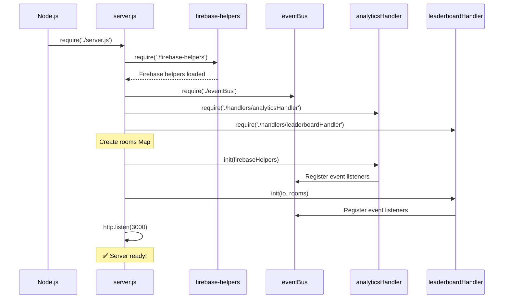
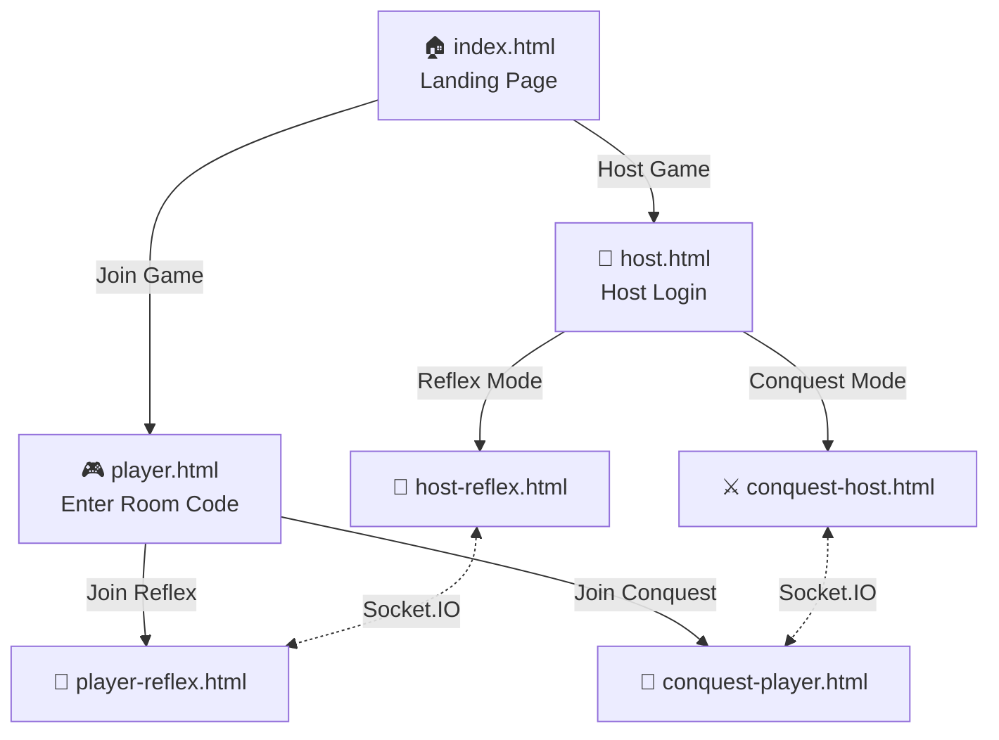

# Reflex Royale - Project Documentation

## 📁 Project Structure (Organized by Layer)

```
reflex-royale/
│
├── 🔧 CONFIGURATION LAYER
│   ├── package.json              # Dependencies & scripts
│   ├── render.yaml               # Render deployment config
│   ├── railway.toml              # Railway deployment config
│   ├── .gitignore                # Git ignore rules
│   └── .platform/                # Platform-specific configs
│       ├── render/
│       └── railway/
│
├── 🖥️ SERVER LAYER (Backend - Node.js)
│   ├── server.js                 # Main server - Express + Socket.IO
│   ├── eventBus.js               # Event-driven architecture core
│   ├── firebase-helpers.js       # Firebase integration
│   └── handlers/                 # Event handlers (separation of concerns)
│       ├── analyticsHandler.js   # Firebase analytics events
│       └── leaderboardHandler.js # Leaderboard update events
│
├── 🌐 CLIENT LAYER (Frontend - HTML/CSS/JS)
│   └── public/
│       │
│       ├── 📄 HTML PAGES
│       │   ├── index.html            # Landing page (entry point)
│       │   ├── host.html             # Host mode selector
│       │   ├── host-reflex.html      # Reflex game host screen
│       │   ├── player.html           # Player entry page
│       │   ├── player-reflex.html    # Reflex game player screen
│       │   ├── conquest-host.html    # Conquest mode host
│       │   ├── conquest-player.html  # Conquest mode player
│       │   └── debug-conquest.html   # Debug/test page
│       │
│       ├── 🎨 CSS (Styling)
│       │   ├── shared.css            # Common styles
│       │   ├── host.css              # Host-specific styles
│       │   ├── player.css            # Player-specific styles
│       │   └── conquest.css          # Conquest mode styles
│       │
│       ├── ⚡ JAVASCRIPT (Client Logic)
│       │   ├── utils.js              # Shared utilities
│       │   ├── host.js               # Host game logic
│       │   ├── player.js             # Player game logic
│       │   ├── conquest-host.js      # Conquest host logic
│       │   └── conquest-game.js      # Conquest game logic
│       │
│       └── 🖼️ ASSETS
│           ├── controller-icon-v2.png
│           ├── student-icon.png
│           └── mario_spritesheet.png
│
├── 📦 BUILD & DISTRIBUTION
│   ├── build.js                  # Build script (minification)
│   └── dist/                     # Production build output
│
└── 📚 DOCUMENTATION
    ├── README.md                 # Main documentation
    ├── docs/                     # GitHub Pages docs
    └── Reflex_Royale_Documentation/
```

---

## 🔄 System Activity Diagram

### Overall Architecture



---

## 🎮 Game Flow Sequence

### 1. Room Creation Flow



### 2. Player Join Flow



### 3. Game Round Flow (Reflex Mode)



### 4. Scoring Flow with EventBus



---

## 📊 Data Flow

### Room State Structure

```javascript
rooms = Map {
  "1234" => {
    code: "1234",
    hostId: "socket_abc123",
    gameMode: "REFLEX",
    gameState: "WAITING" | "PLAYING" | "FINISHED",
    players: Map {
      "socket_xyz" => { id, nickname, score },
      "socket_abc" => { id, nickname, score }
    },
    currentRound: 1,
    totalRounds: 4,
    roundType: "COLOR_TAP" | "SWIPE" | "SHAKE" | "TAP_SPAM",
    roundData: { color: "RED" } | { direction: "UP" },
    roundStartTime: 1704290000000,
    responses: Map { playerId => responseData }
  }
}
```

### Event Types

| Event | Emitted By | Listened By | Purpose |
|-------|------------|-------------|---------|
| `PLAYER_JOINED` | server.js | analyticsHandler | Track new player |
| `SCORE_UPDATED` | server.js | leaderboardHandler | Update leaderboard |
| `ROUND_ENDED` | server.js | leaderboardHandler | Force leaderboard update |
| `GAME_ENDED` | server.js | analyticsHandler, leaderboardHandler | Save results, cleanup |

---

## 🔗 File Dependencies



---

## 🚀 Startup Sequence



---

## 📱 Page Navigation Map


