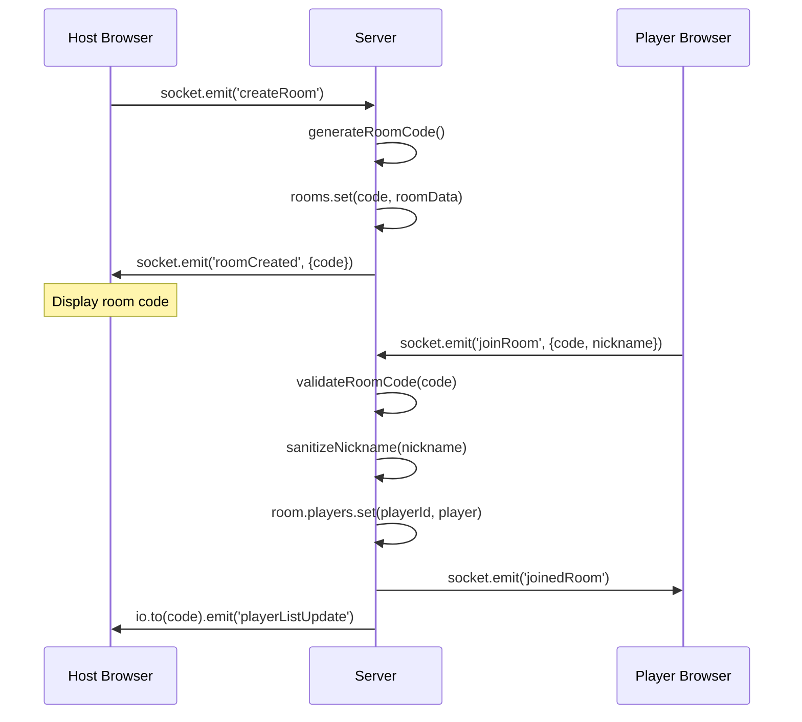
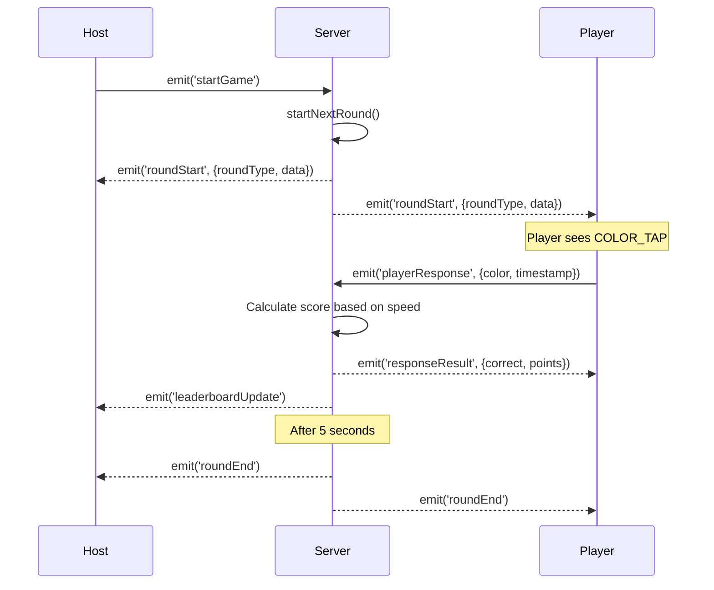

# 📐 Architecture Documentation

> Chi tiết kỹ thuật về cấu trúc project Reflex Royale

---

## 📊 Overview Diagram

```mermaid
graph TB
    subgraph "Client (Browser)"
        A[Landing Page] --> B[Host Screen]
        A --> C[Player Screen]
        B --> D[Reflex Host]
        B --> E[Conquest Host]
        C --> F[Reflex Player]
        C --> G[Conquest Player]
    end
    
    subgraph "Server (Node.js)"
        H[server.js]
        I[firebase-helpers.js]
        H --> I
    end
    
    subgraph "External Services"
        J[Firebase/Firestore]
        K[Render/Railway]
    end
    
    D -.Socket.IO.-> H
    E -.Socket.IO.-> H
    F -.Socket.IO.-> H
    G -.Socket.IO.-> H
    H --> J
    K --> H
```

---

## 📁 File Structure & Explanations

### 🔴 Root Files

#### `server.js` (29KB) ⭐ CORE SERVER

**Chức năng**: Main server logic

**Responsibilities**:
- Express server setup
- Socket.IO connection handling
- Room management (create, join, leave)
- Game state management
- Round logic (Reflex & Conquest)
- Security middleware (Helmet, Rate limiting)
- Player validation & sanitization

**Key Functions**:
```javascript
// Room Management
generateRoomCode()          // Generate 4-digit room code
validateRoomCode(code)      // Validate room code format
sanitizeNickname(nickname)  // Prevent XSS attacks

// Game Flow
startNextRound(roomCode)    // Reflex: start new round
startConquestRound(roomCode)// Conquest: start new round
endRound(roomCode)          // Calculate scores
endGame(roomCode)           // Save to Firebase

// Security
logSecurityEvent(type, details) // Log auth events
```

**Socket.IO Events**:
| Event | Direction | Purpose |
|-------|-----------|---------|
| `createRoom` | Client → Server | Host creates room |
| `roomCreated` | Server → Client | Send room code |
| `joinRoom` | Client → Server | Player joins |
| `joinedRoom` | Server → Client | Confirm join |
| `startGame` | Client → Server | Start game |
| `roundStart` | Server → Client | New round begins |
| `playerResponse` | Client → Server | Player answer |
| `roundEnd` | Server → Client | Round finished |
| `gameOver` | Server → Client | Game finished |

**Dependencies**:
- `express` - HTTP server
- `socket.io` - Real-time communication
- `helmet` - Security headers
- `express-rate-limit` - DDoS protection
- `xss` - XSS prevention
- `hpp` - HTTP parameter pollution

---

#### `firebase-helpers.js` (3.3KB)

**Chức năng**: Firebase Firestore integration

**Responsibilities**:
- Initialize Firebase Admin SDK
- Track players (ID, nickname, timestamp)
- Update player scores
- Save game results & leaderboards

**Key Functions**:
```javascript
trackPlayer(playerId, nickname)
  // Input: socket.id, player name
  // Output: Firestore doc in 'players' collection
  // Purpose: Track player join time

updatePlayerScore(playerId, score)
  // Input: socket.id, final score
  // Output: Update Firestore player doc
  // Purpose: Accumulate player stats

saveGameResult(gameId, gameType, roomCode, leaderboard, winner)
  // Input: Game metadata
  // Output: Firestore doc in 'gameHistory' collection
  // Purpose: Historical leaderboards
```

**Firestore Schema**:
```
players/
  {playerId}/
    - nickname: String
    - totalScore: Number
    - lastPlayed: Timestamp
    
gameHistory/
  {gameId}/
    - gameType: "REFLEX" | "CONQUEST"
    - roomCode: String
    - winner: Object
    - leaderboard: Array
    - timestamp: Timestamp
```

**Graceful Fallback**: If Firebase not configured, all functions become no-ops (silent fail).

---

#### `package.json` (0.6KB)

**Chức năng**: Project metadata & dependencies

**Scripts**:
```json
{
  "start": "node server.js"  // Production
}
```

**Dependencies**:
| Package | Version | Purpose |
|---------|---------|---------|
| `express` | ^4.18.2 | Web framework |
| `socket.io` | ^4.8.1 | WebSocket |
| `firebase-admin` | ^12.0.0 | Database |
| `helmet` | ^7.1.0 | Security |
| `express-rate-limit` | ^7.1.5 | Rate limiting |
| `xss` | ^1.0.14 | XSS sanitization |
| `hpp` | ^0.2.3 | HPP protection |

---

### 📂 `/public` - Client-Side Files

#### HTML Files

| File | Purpose | User | Features |
|------|---------|------|----------|
| `index.html` | Landing page | All | Mode selection |
| `host.html` | Mode picker | Host | Reflex/Conquest choice |
| `host-reflex.html` | Reflex host UI | Host | Room code, controls, leaderboard |
| `conquest-host.html` | Conquest host UI | Host | Map display, timer |
| `player.html` | Join screen | Player | Enter code & name |
| `player-reflex.html` | Reflex player UI | Player | Color tap, swipe, shake |
| `conquest-player.html` | Conquest player UI | Player | Map selection |

#### JavaScript Files (`/public/js`)

| File | Links To | Purpose |
|------|----------|---------|
| `host.js` | `host-reflex.html` | Reflex host logic |
| `conquest-host.js` | `conquest-host.html` | Conquest host logic |
| `player.js` | `player-reflex.html` | Reflex player interactions |
| `conquest-player.js` | `conquest-player.html` | Conquest player logic |
| `conquest-game.js` | Both conquest files | Shared game grid logic |

**`conquest-game.js` Classes**:
```javascript
class ConquestGrid {
  // Manages 10x10 game grid
  initializeSpecialCells(count)  // Place x2, x3 cells
  updateCells(cellsData)         // Update owner/multiplier
}

class ConquestRenderer {
  // Renders grid to DOM
  render()                       // Draw entire grid
  setupClickHandlers()           // For player selection
}
```

#### CSS Files (`/public/css`)

| File | Scope | Content |
|------|-------|---------|
| `shared.css` | Global | Variables, reset, utilities |
| `host.css` | Host screens | Leaderboards, controls |
| `player.css` | Player screens | Mobile-optimized buttons |

---

### 📂 `/.platform` - Hosting Configs

#### `/render/render.yaml` (0.5KB)

**Chức năng**: Render deployment blueprint

```yaml
services:
  - type: web
    name: reflex-royale
    runtime: node
    plan: free
    buildCommand: npm install
    startCommand: npm start
    envVars:
      - key: HOST_PASSWORD
        sync: false
      - key: FIREBASE_SERVICE_ACCOUNT
        sync: false
```

#### `/railway/railway.toml` (0.4KB)

**Chức năng**: Railway deployment config

```toml
[build]
builder = "NIXPACKS"

[deploy]
startCommand = "npm start"
healthcheckPath = "/"
```

---

### 📂 `/docs` - Documentation & Assets

| File | Type | Purpose |
|------|------|---------|
| `index.html` | GitHub Pages | User guide (Vietnamese) |
| `HOSTING_GUIDE.md` | Documentation | Platform comparison |
| `*.png` | Images | Screenshots |
| `*.webp` | Animated images | Demo videos |

---

## 🔄 Request Flow

### Creating & Joining a Room



### Playing a Reflex Round



---

## 🗃️ Data Models

### Room Object (In-memory)

```javascript
{
  code: "1234",              // 4-digit string
  hostId: "socket_abc123",   // Host socket ID
  gameMode: "REFLEX",        // or "CONQUEST"
  gameState: "WAITING",      // "WAITING" | "PLAYING" | "FINISHED"
  players: Map<socketId, Player>,
  
  // Reflex specific
  currentRound: 1,
  totalRounds: 7,
  roundType: "COLOR_TAP",
  roundData: { color: "RED" },
  
  // Conquest specific
  currentRound: 1,
  maxRounds: 5,
  grid: ConquestGrid,
  specialCells: [{x, y, multiplier}]
}
```

### Player Object

```javascript
{
  id: "socket_xyz789",     // Socket ID
  nickname: "Anna",        // Sanitized name (max 20 chars)
  score: 1500,            // Reflex: points
  territory: 25           // Conquest: cells owned
}
```

---

## 🔒 Security Architecture

### Layers

```
┌─────────────────────────────────┐
│   1. Helmet.js (HTTP Headers)   │
├─────────────────────────────────┤
│   2. Rate Limiting (DDoS)       │
├─────────────────────────────────┤
│   3. HPP (Parameter Pollution)  │
├─────────────────────────────────┤
│   4. Input Validation           │
│      - validateRoomCode()       │
│      - sanitizeNickname()       │
├─────────────────────────────────┤
│   5. Socket.IO Middleware       │
│      - Connection rate limit    │
├─────────────────────────────────┤
│   6. CORS Configuration         │
├─────────────────────────────────┤
│   7. Security Logging           │
└─────────────────────────────────┘
```

**Content Security Policy**:
```javascript
{
  defaultSrc: ["'self'"],
  scriptSrc: ["'self'", "'unsafe-inline'"],
  connectSrc: ["'self'", "wss:", "ws:"],
  // Allows Socket.IO & Firebase
}
```

---

## 📈 Scalability Considerations

| Component | Current | Max Tested | Bottleneck |
|-----------|---------|------------|------------|
| Concurrent players | 50-100 | 500 | Socket.IO connections |
| Rooms | ~10 | ~100 | Server memory (Map) |
| Firebase writes | ~10/s | ~100/s | Firestore quota |

**Optimization Tips**:
- Use Redis for room storage (scale horizontally)
- Add Socket.IO Redis adapter for multi-server
- Batch Firebase writes
- Use CDN for static assets

---

## 🧪 Testing Recommendations

### Unit Tests (Not included)
- `validateRoomCode()` - various inputs
- `sanitizeNickname()` - XSS attempts
- `generateRoomCode()` - uniqueness

### Integration Tests
- Room creation & join flow
- Player disconnect handling
- Round progression

### Load Testing
```bash
# Use Socket.IO client
npm install -g artillery
artillery quick --count 100 -n 10 http://localhost:3000
```

---

## 🤔 Design Decisions

### Why Socket.IO over WebSocket native?
- Auto-reconnection
- Built-in rooms/namespaces
- Fallback to HTTP long-polling

### Why Firebase over PostgreSQL?
- No-ops friendly
- Real-time listeners (future feature)
- Simple setup for students

### Why Vanilla JS over React?
- Zero build step
- Faster prototyping
- Easier for beginners to understand

---

## 📚 Further Reading

- [Socket.IO Docs](https://socket.io/docs/)
- [Firebase Admin SDK](https://firebase.google.com/docs/admin/setup)
- [Helmet.js Security](https://helmetjs.github.io/)
- [Express Best Practices](https://expressjs.com/en/advanced/best-practice-security.html)

---

<p align="center">
  📝 Last updated: 2024-12-31
</p>
